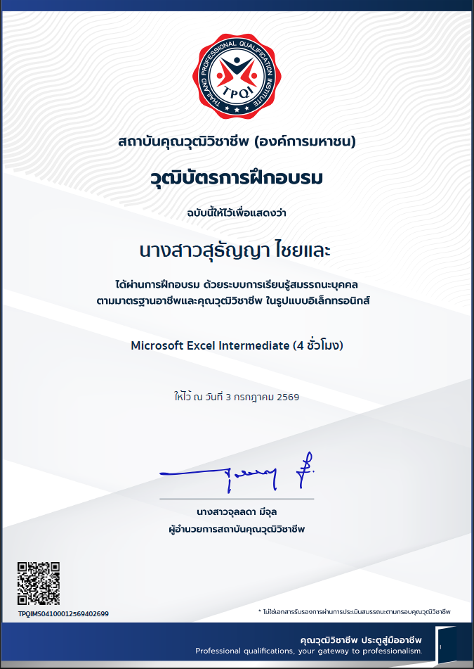
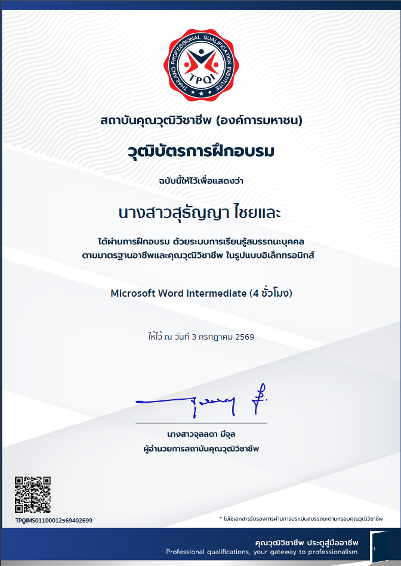
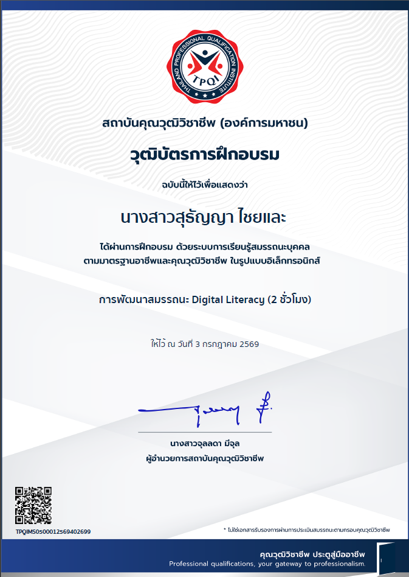

# 🎖️ My Certificates & Certifications

คลังเก็บใบประกาศนียบัตรและใบเซอร์ต่างๆ ของ **นางสาวสุธัญญา ไชยและ** เพื่อพัฒนาทักษะและการเรียนรู้อย่างต่อเนื่อง

---

## 🚀 รายการใบประกาศนียบัตร

### 💻 ด้านทักษะดิจิทัลและสำนักงาน (Digital & Office Skills)

#### 1. Microsoft Excel Intermediate (4 ชั่วโมง)
* **สถาบัน:** สถาบันคุณวุฒิวิชาชีพ (องค์การมหาชน) - TPQI
* **วันที่ได้รับ:** 3 กรกฎาคม 2569
* **เลขที่ใบเซอร์:** TPQIM504100012569402699
* **หลักฐานตัวเต็ม:** 📄 [ดาวน์โหลดไฟล์ PDF](excel-intermediate.pdf?raw=true)
* **รูปภาพใบเซอร์:** 
  

---

#### 2. Microsoft Word Intermediate (4 ชั่วโมง)
* **สถาบัน:** สถาบันคุณวุฒิวิชาชีพ (องค์การมหาชน) - TPQI
* **วันที่ได้รับ:** 3 กรกฎาคม 2569
* **เลขที่ใบเซอร์:** TPQIMS01100012569402699
* **หลักฐานตัวเต็ม:** 📄 [ดาวน์โหลดไฟล์ PDF](word-intermediate.pdf)
* **รูปภาพใบเซอร์:** 
  

---

#### 3. การพัฒนาสมรรถนะ Digital Literacy (2 ชั่วโมง)
* **สถาบัน:** สถาบันคุณวุฒิวิชาชีพ (องค์การมหาชน) - TPQI
* **วันที่ได้รับ:** 3 กรกฎาคม 2569
* **เลขที่ใบเซอร์:** TPQIM50500012569402699
* **หลักฐานตัวเต็ม:** 📄 [ดาวน์โหลดไฟล์ PDF](digital-literacy.pdf)
* **รูปภาพใบเซอร์:** 
  
